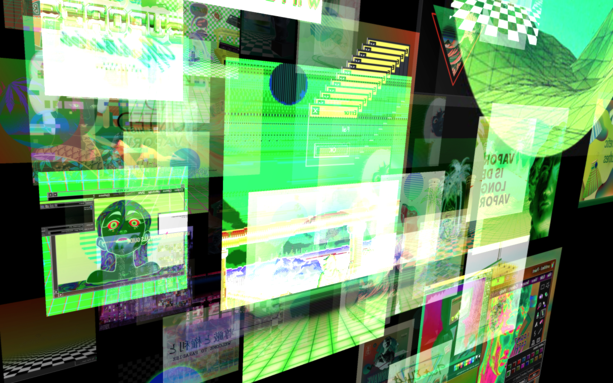

# image-scraper-n4m

Scrape images from Google and use them as textures on Multiple gridshapes in Jitter

#### [More visuals and code!](http://gumroad.com/tmhglnd)

#### [Become a Patron!](https://www.patreon.com/bePatron?u=9649817)



# About

Specify your search for Google Images and batch download 100+ images to your drive via Node4Max, set search preferences such as color-mode (color, grayscale), image-size (large, medium), license (for example non-commercial) and more. You can also apply post-processing in batch (resize, square, invert, grayscale) and directly load them into textures running on the graphics card with th.gl.texturefolder. 

This project demonstrates how [node.script] can be used to to combine various node packages (image-scraper, jimp, image-size) to download many images based on your image-search and apply them to a Jitter visual project.
# Install 

Download zip
```
1. download zip
2. unzip and place in Max Searchpath (eg. MacOS ~/Documents/Max 8/Library)
3. restart Max8
```
Git clone
```
1. $ cd ~/Documents/Max\ 8/Library
2. $ git clone https://github.com/tmhglnd/image-scraper-n4m.git
3. restart Max8
```

Go to the directory and run
```
$ npm install
```

Also download the dependencies below and follow those instructions:

# Dependencies

This project requires the th.gl.texturefolder abstraction:

- [th.gl.texturefolder](https://github.com/tmhglnd/th.gl.texturefolder)

# Thanks

Thanks to the following NPM packages:

- [image-scraper](https://www.npmjs.com/package/image-scraper)
- [jimp](https://www.npmjs.com/package/jimp)
- [image-size](https://www.npmjs.com/package/image-size)